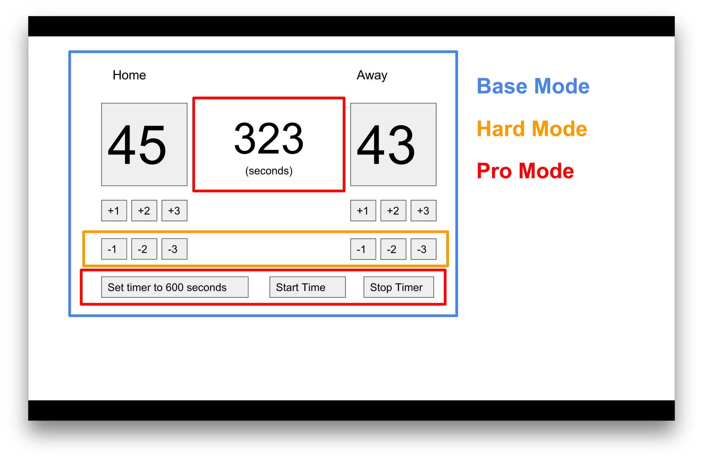

# jQuery-scoreboard
The local basketball team would like a brand new scoreboard and they've asked you to help. 
The server and `index.html` and CSS for this project has already been created, but they need help with the functionality. 
None of their buttons do anything!
You may edit the HTML and CSS if you would like, but that should not be the focus of your effort (not a part of the assignment).

## Setup

1. Fork the repository
2. Clone your repo to your computer
3. Navigate to the new folder
4. Run `npm install`
5. Run `npm start` and navigate to `localhost:5000`

## Wireframe

## Base Mode
The `+1`, `+2`, and `+3` buttons should add that many points to the corresponding team's score.

## Hard Mode
The `-1`, `-2`, and `-3` buttons should remove that many points to the corresponding team's score. 
It isn't shown in the wireframe, but the school would also like a button to clear the scores and reset them back to `0`.

## Pro Mode
The scoreboard needs a timer. Hook up the `Set Timer to 600 Seconds`, `Start Timer`, and `Stop Timer` buttons to countdown all the way from `600` to `0` seconds.

## Ultra Pro Mode
The school realized that people like timers in minutes. Convert the `Set Timer to 600 Seconds` button to `Set Timer to 10 minutes`. 
Then make the timer countdown go from `10:00`, `9:59`, all the way to `0:00`.
